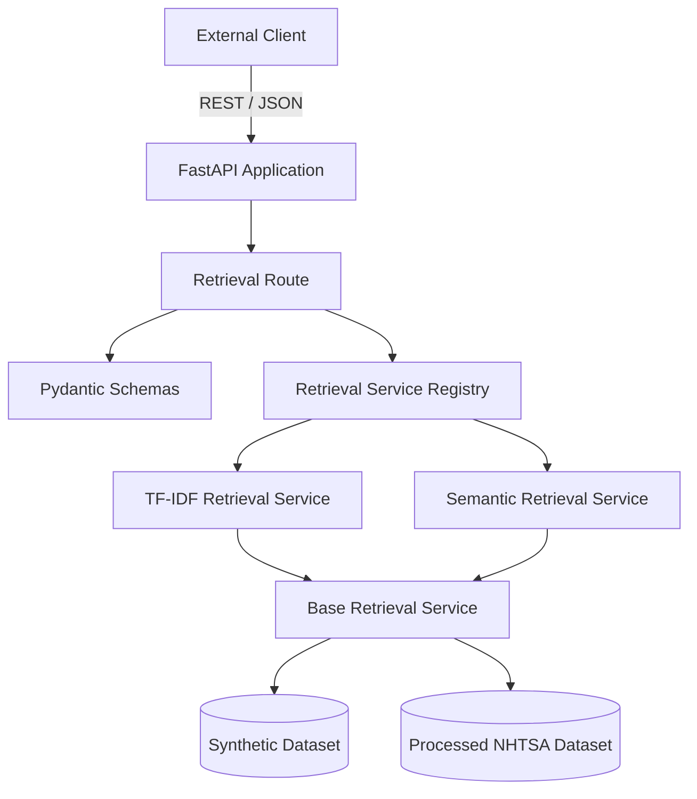

# System Architecture

## Overview

The Automotive After-Sales Service Assistant API is a FastAPI-based backend prototype for natural-language retrieval over automotive text records.

The current implementation supports:

- TF-IDF retrieval
- sentence-embedding retrieval
- synthetic and NHTSA datasets
- metadata filtering
- source provenance
- Pydantic request and response validation
- automated API and preprocessing tests
- OpenAPI documentation

## High-Level Architecture



## Request Flow

A retrieval request follows this sequence:

```text
External client
→ FastAPI route
→ Pydantic request validation
→ retrieval method and dataset selection
→ optional metadata filtering
→ similarity calculation
→ result ranking
→ structured response
```

The current endpoint is:

```http
POST /retrieval/search
```

Example request:

```json
{
  "query": "The brake pedal stopped responding while driving",
  "top_k": 5,
  "method": "semantic",
  "dataset": "nhtsa",
  "filters": {
    "category": "Braking System"
  }
}
```

## Application Layers

### Routes

Routes define the HTTP interface and coordinate application services.

Current route modules:

```text
app/routes/health.py
app/routes/retrieval.py
```

The retrieval route is responsible for:

- accepting a validated request
- selecting the appropriate retrieval service
- handling unavailable datasets
- returning the structured response

It does not implement vectorization, filtering, or ranking logic.

### Schemas

Pydantic schemas define the API contract.

The retrieval schemas validate:

- natural-language query length
- maximum result count
- supported retrieval methods
- supported datasets
- optional metadata filters
- response metadata and result fields

Unexpected request fields are rejected to prevent silent input errors.

### Services

Service modules contain retrieval and data-processing logic.

```text
BaseRetrievalService
├── TfidfRetrievalService
└── SemanticRetrievalService
```

`BaseRetrievalService` provides shared behaviour:

- CSV loading
- required-column validation
- optional-column normalization
- search-document construction
- metadata filtering
- ranking and response formatting

The two concrete retrieval services implement their own document and query representations.

### Retrieval Registry

The retrieval registry manages service instances for each supported combination:

```text
TF-IDF + synthetic
TF-IDF + NHTSA
Semantic + synthetic
Semantic + NHTSA
```

The instances are cached so that datasets and vector representations are not rebuilt for every request.

### Data Sources

The project currently uses two data sources.

#### Synthetic service records

```text
data/service_records.csv
```

This small controlled dataset supports deterministic tests and simple local demonstrations.

#### NHTSA consumer complaints

```text
data/processed/nhtsa_service_records.csv
```

This processed public dataset supports larger retrieval experiments, vehicle metadata filtering, and source-aware results.

## Retrieval Methods

### TF-IDF

The TF-IDF service creates a sparse document matrix and ranks records using cosine similarity.

It is suitable for:

- terminology-heavy searches
- exact or partially overlapping keywords
- fast and explainable baseline retrieval

### Semantic Retrieval

The semantic service uses a pretrained SentenceTransformer model to encode queries and records as dense vectors.

It is suitable for:

- natural-language queries
- paraphrases
- semantically related expressions with limited word overlap

The embedding model is reused across datasets, while each dataset keeps its own document embeddings in memory.

## Metadata Filtering

Supported filters currently include:

- issue category
- vehicle make
- vehicle model
- model year

Filtering is applied before ranking:

```text
dataset
→ metadata filter
→ eligible records
→ similarity ranking
→ top-k results
```

This design combines structured database-style selection with natural-language retrieval.

## Source Provenance

Every result includes a source field.

Examples:

```text
Synthetic service records
NHTSA Consumer Complaints
```

The source field allows clients to identify where the returned text originated and supports traceability across multiple datasets.

## Integration Model

The API is independent of any specific frontend.

Possible clients include:

- Swagger UI
- web applications
- mobile applications
- low-code platforms
- workflow automation tools
- other backend services

Clients communicate with the API through documented REST endpoints and structured JSON responses.

## Current Limitations

- Data is loaded from processed CSV files rather than a database.
- Semantic embeddings are stored only in application memory.
- Metadata filters use exact matching.
- Retrieval evaluation currently uses a small labelled query set.
- Authentication and authorization are not yet implemented.
- The service has not yet been deployed as a production system.
