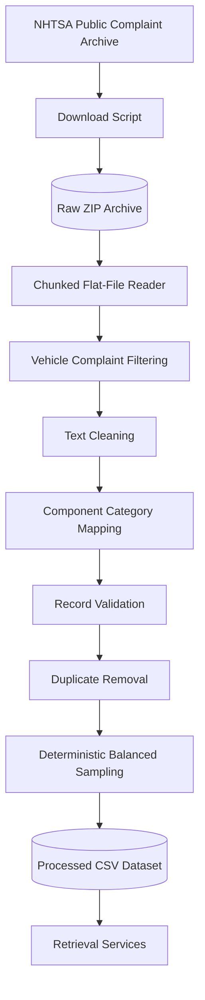

# NHTSA Data Pipeline

## Purpose

The project uses public NHTSA consumer complaint data to support retrieval and later classification experiments.

The raw complaint archive is not used directly by the FastAPI application. It is downloaded, validated, cleaned, normalized, sampled, and exported into the project's internal record format.

## Data Flow



## Project Files

```text
data/
├── raw/
│   └── COMPLAINTS_RECEIVED_2025-2026.zip
├── processed/
│   └── nhtsa_service_records.csv
└── service_records.csv

scripts/
├── download_nhtsa_complaints.py
└── prepare_nhtsa_data.py
```

The downloaded ZIP file remains local and is excluded from Git.

The processed CSV is committed so that the API can be tested without downloading and processing the full archive on every setup.

## Downloading the Raw Dataset

Run the download script as a module:

```bash
python -m scripts.download_nhtsa_complaints
```

The archive is saved to:

```text
data/raw/COMPLAINTS_RECEIVED_2025-2026.zip
```

The download script:

- creates the destination directory
- avoids downloading an existing archive by default
- writes to a temporary `.part` file during download
- renames the file only after a successful download
- removes incomplete temporary files after network errors

## Preparing the Dataset

Run:

```bash
python -m scripts.prepare_nhtsa_data \
  --max-records 2000 \
  --max-per-category 250
```

The processed dataset is written to:

```text
data/processed/nhtsa_service_records.csv
```

## Processing Steps

### 1. Chunked reading

The tab-delimited complaint data is read directly from the ZIP archive in chunks.

Chunked reading limits memory use and allows the same processing logic to work with larger source files.

### 2. Product filtering

Only vehicle complaint records are retained.

Non-vehicle product types are excluded because the API focuses on vehicle service and safety issues.

### 3. Text normalization

Complaint narratives and metadata are normalized by:

- removing line breaks and tabs
- collapsing repeated whitespace
- trimming surrounding whitespace
- converting missing values to empty strings

### 4. Component normalization

Detailed NHTSA component descriptions are retained in the `component` field.

A readable title is generated from the component description.

### 5. Category mapping

Detailed components are mapped to broader project categories through transparent keyword rules.

Current categories include:

- Air Bags
- Body and Structure
- Braking System
- Driver Assistance
- Electrical System
- Engine
- Fuel System
- Power Train
- Seat Belts
- Steering
- Tires and Wheels
- Visibility

Records that cannot be mapped to a supported category are excluded from the processed sample.

### 6. Narrative-length validation

Very short complaint narratives are removed because they contain insufficient information for meaningful retrieval or classification.

### 7. Date normalization

Supported NHTSA date values are converted from:

```text
YYYYMMDD
```

to:

```text
YYYY-MM-DD
```

Invalid or incomplete date values are stored as empty fields.

### 8. Duplicate removal

Duplicate records are removed using:

- record ID
- component
- complaint description

### 9. Balanced sampling

A maximum number of records is selected for each broad category.

This reduces the risk that a highly frequent category dominates local retrieval and classification experiments.

The sampling process uses a fixed random seed so that results are reproducible.

## Processed Schema

The processed dataset contains:

```text
record_id
title
description
category
component
make
model
model_year
received_date
crash
fire
injured
deaths
source
```

Every processed record contains:

```text
source = NHTSA Consumer Complaints
```

## Synthetic and Public Data

The two datasets serve different purposes.

### Synthetic dataset

```text
data/service_records.csv
```

Used for:

- deterministic endpoint tests
- fixed expected rankings
- fast development checks
- small labelled retrieval evaluation

### NHTSA dataset

```text
data/processed/nhtsa_service_records.csv
```

Used for:

- real-text retrieval experiments
- metadata filtering
- classification training and evaluation
- larger-scale local demonstrations
- source-aware API results

The synthetic dataset is not replaced by the public dataset because stable automated tests require predictable records.

## Validation and Tests

The preprocessing tests verify:

- whitespace normalization
- component-to-category mapping
- project-schema creation
- date formatting
- source assignment
- exclusion of non-vehicle records

Run:

```bash
python -m pytest tests/test_nhtsa_preprocessing.py -v
```

Run the complete project test suite with:

```bash
python -m pytest -v
```

## Reproducibility

The processed dataset can be regenerated from the raw archive using the same commands and parameters.

Reproducibility depends on:

- the selected source archive
- category-mapping rules
- maximum record settings
- fixed random seed
- preprocessing code version

## Current Limitations

- Category mapping uses manually defined keyword rules.
- Unmapped complaint components are excluded.
- The processed dataset is a balanced sample rather than the full archive.
- Complaint narratives may contain informal language and reporting noise.
- The pipeline does not yet persist records in a relational database.
- The processed labels have not yet been manually audited at large scale.
